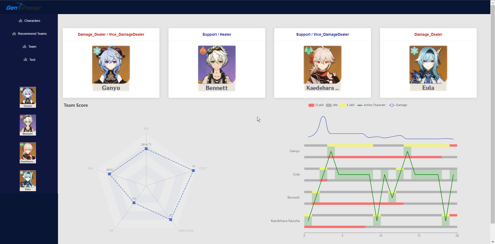

Genshin Team Paring

[3.3更新]
- 
- 增加了伤害轴可视化

描述了20s的伤害轴中，谁应何时上场、Q/E技能timing和持续时间、以及伤害，分别用散点、堆积图和趋势线表示。靠上的堆积图表示E技能释放timing和持续时间，靠下的堆积图表示Q技能释放timing和持续时间。散点代表当前场上角色，切人的逻辑在DCcalc()方法中有描述。趋势线代表伤害估算，比如图里趋势线第一个波峰是四人都开大所致，趋势线前半段较高，因为万叶Q技能在生效中（攻击型辅助的大招一律简化为增上）

- 把角色界面和team界面里的card高度都定死了，解决了分辨率导致有时候缺一块的现象

- 换了个logo，用ba风格生成器弄的便宜logo，synergy在游戏里代表游戏配合，就用了这个词

- 存在的问题：
    - 伤害轴数据系列有时候会莫名其妙多出几个对象，表现为横轴不止20秒。比如，控制台输出的伤害轴图的series只有26个对象，在tooltip里看到的却有28个对象。不过重新编译就恢复正常了。真正原因还不知道
    - 左边的雷达图有超量程的风险，但由于算法太复杂一时不知道最极端情况是多少